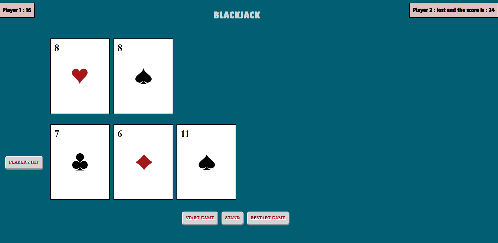

# Milestone 4 : Blackjack

# Team members :
##             . Sunitha
##             . Ramsai

# Game Layout 

# How the game works ?
- The North American game of Blackjack, also known as 21, has been one of the most popular casino games of the last hundred years and has spread throughout the world. In the 21st century it has been overtaken in popularity by Slots (slot machine games), but it remains one of the most popular casino card games and is available in almost all casinos both on and offline.

- Blackjack is a casino banked game, meaning that players compete against the house rather than each other. The objective is to get a hand total of closer to 21 than the dealer without going over 21 (busting).

- At the start of a Blackjack game, the players and the dealer receive two cards each. The players' cards are normally dealt face up, while the dealer has one face down (called the hole card) and one face up. The best possible Blackjack hand is an opening deal of an ace with any ten-point card.

- The house advantage of this game is derived from several rules that favour the dealer. The most significant of these is that the player must act before the dealer, allowing the player to bust and lose their bet before the dealer plays.

- Players should be aware that there is another card game called Black Jack in the UK which is an entirely different card game, effectively the same as Crazy Eights.

# Card Values

- When playing Blackjack the numeral cards 2 to 10 have their face values, Jacks, Queens and Kings are valued at 10, and Aces can have a value of either 1 or 11. The Ace is always valued at 11 unless that would result in the hand going over 21, in which case it is valued as 1.

- Any hand with an Ace valued as 11 is called a ‘soft’ hand. All other hands are ‘hard’ hands.

- A starting hand of a 10 valued card and, an Ace is called a Blackjack or natural and beats all hands other than another Blackjack. If both the player and dealer have Blackjack, the result is a push (tie): neither the player nor the bank wins and the bet is returned to the player.

